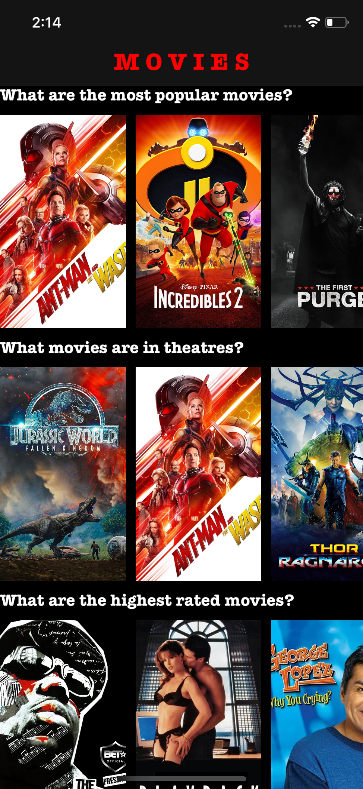
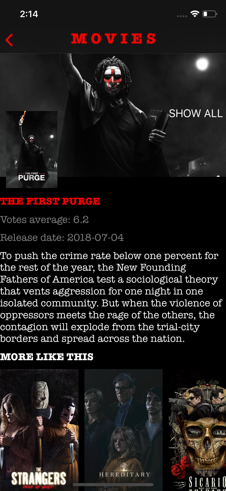

## Movies

#### Uses [www.themoviedb](https://www.themoviedb.org) API  to show popular movies and its details

## Development technologies:

- MVVM Architecture
- Custom collectionView layout (Mosaic - [Column based algorithm](http://blog.vjeux.com/2012/image/image-layout-algorithm-lightbox.html))
- Auto Layout in code

## Screenshots:

| Movies List                                 | Movie Details                                   | Movie Images                                  |
| ------------------------------------------- | ----------------------------------------------- | --------------------------------------------- |
|  |  |  |

